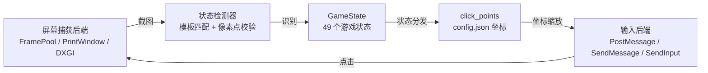

# CZN Zero Farm

> 《卡厄思梦境》（Chaos Zero Nightmare）PC 端零式系统自动刷取脚本

[](https://www.python.org/)
[](https://www.microsoft.com/windows)
[](https://github.com/zhiyiYo/PyQt-Fluent-Widgets)
[](LICENSE)

基于 **OpenCV 模板匹配 + 状态机** 的纯视觉自动化脚本，无需 AI 模型、无需 GPU。
通过截图识别当前游戏画面所处的状态，再按配置坐标自动点击，实现零式系统全流程无人值守刷取，同时支持赛季图 OCR 刷取指定 Buff。支持 **国服 / 国际服** 双版本。

---

## 目录

- [核心特性](#核心特性)
- [工作原理](#工作原理)
- [系统要求](#系统要求)
- [快速开始](#快速开始)
- [使用指南](#使用指南)
- [两种刷取模式](#两种刷取模式)
- [模板采集与调试](#模板采集与调试)
- [常见问题](#常见问题)
- [项目结构](#项目结构)
- [免责声明](#免责声明)

---

## 核心特性

| 能力 | 说明 |
|---|---|
| 全流程自动刷层 | 主菜单 → 零式入口 → 选/合成法典 → 配队 → 选 Buff → 选房间 → 战斗 → 结算，自动循环 |
| 赛季图 OCR 刷取 | 纯 OCR 驱动循环刷指定关键词 Buff，刷到目标即停 |
| 状态机识别 | 49 个游戏状态，有序模板匹配 + 像素点校验双重判定，误判率低 |
| 自动战斗 | 检测自动战斗开关状态并一键开启；战斗模块按手牌轮廓自动出牌 |
| 三种输入后端 | PostMessage（后台不碰鼠标，推荐）/ SendMessage（后台）/ SendInput（前台） |
| 三种截图后端 | FramePool（后台/遮挡可截，默认）/ PrintWindow（后台可截）/ DXGI（前台最快） |
| 双版本模板 | 国服 / 国际服模板一键切换 |
| 全局热键 | F6 开始 / F8 停止 / F9 暂停（需管理员权限） |
| 现代化 GUI | PySide6 + Fluent 暗色界面，高 DPI 适配，内置调试工具 |
| 实时统计 | 运行局数、战斗数、事件数、运行时长 |
| 防锁屏 | 运行期间可阻止系统休眠 / 锁屏 |

---

## 工作原理



- **状态机循环**：截屏 → 识别 `GameState` → 按状态查 `config.json` 坐标 → 点击，如此往复。
- **坐标驱动**：所有点击坐标基于 1920×1080 基准分辨率，运行时按实际窗口分辨率自动缩放。
- **零硬编码行为**：调整脚本行为优先改 `config.json`，而非改代码。

---

## 系统要求

| 项目 | 要求 |
|---|---|
| 操作系统 | Windows 10 / 11（**仅限 Windows**） |
| Python | 3.11 或更高（仅源码运行需要） |
| 游戏 | 卡厄思梦境（Chaos Zero Nightmare）— 国服 / 国际服 |
| 分辨率 | 推荐 1920×1080，其他分辨率按比例缩放 |
| 权限 | **管理员权限**（全局热键需要；否则仅界面按钮可用） |

---

## 快速开始

### 方式一：下载打包版（推荐普通用户）

1. 前往 [Releases](../../releases) 下载最新的 `CZN_Zero_Farm.zip`。
2. 解压到任意目录。
3. **右键以管理员身份**运行其中的 `CZN_Zero_Farm.exe`。

> 打包版已内置配置、模板与运行环境，无需安装 Python。

### 方式二：源码运行（开发者）

```bash
# 1. 安装 Python 3.11+（安装时勾选 "Add Python to PATH"）

# 2. 获取源码
git clone https://github.com/<your-name>/czn_auto.git
cd czn_auto

# 3. 安装依赖
pip install -r requirements.txt

# 4. 以管理员身份启动 GUI
python -m core.gui
```

> 若未以管理员身份运行，全局热键 F6/F8/F9 可能失效，但界面按钮仍可正常使用。

---

## 使用指南

### 1. 配置

启动后在左侧导航进入 **「设置」**，按分组调整：

- **运行参数**：刷取模式、服务器（国服/国际服）、截图间隔、点击后等待、状态检查重试。
- **输入模式**：
  - `PostMessage`（后台，推荐）：完全不触碰鼠标，按客户区坐标投递。
  - `SendMessage`（后台）：发送窗口消息，仍会移动光标。
  - `SendInput`（前台）：真实移动光标点击后归位，兼容性最好。
- **截图方式**：
  - `FramePool`（默认）：支持游戏后台 / 被遮挡时截图。
  - `PrintWindow`：后台可截，部分画面可能黑屏。
  - `自动 (DXGI)`：前台最快，被遮挡 / 最小化时失败。
- **战斗参数**：每局最大回合、出牌/选目标/结束回合延时。
- **房间路线优先级**：默认 篝火 > 战斗 > 事件 > 精英（Boss/兜底节点固定优先）。

### 2. 运行

1. 启动游戏并进入主菜单。
2. 在脚本中点击 **「开始」** 或按 **F6**。
3. 脚本自动完成全流程循环刷取。
4. 随时按 **F8 停止** 或 **F9 暂停 / 继续**。

### 3. 热键

| 热键 | 功能 | 备注 |
|---|---|---|
| **F6** | 开始运行 | 全局热键（需管理员权限） |
| **F8** | 停止 | 全局热键 |
| **F9** | 暂停 / 继续 | 全局热键 |

---

## 两种刷取模式

### 零式系统（自动刷层）

完整的零式系统自动循环：

```
MAIN_MENU → ZERO_SYSTEM_ENTRY → CODEX_SELECT → CODEX_SYNTH
   → TEAM_ENTER → BUFF_SELECT → ROOM_SELECT → MAP_SCREEN
   → COMBAT → COMBAT_VICTORY → CARD_REWARD → SKIP
   → RESULT_NEXT → MAP_SCREEN → …（循环刷层）
```

- 房间优先级可在设置中自定义，Boss 节点与保底节点固定兜底。
- 自动检测并开启自动战斗。
- 自动处理结算弹窗、奖励弹窗、确认框等各类弹窗。
- 法典合成：扫描合成按钮直到完成。
- Buff 选择：点击区域框 → 等待事件选项 → 确认完成。
- 死亡后自动提取奖励并重新开始。

### 赛季图初始刷取（OCR 刷 Buff）

纯 OCR 驱动，三阶段循环，刷到目标 Buff 后自动停止：

| 阶段 | 行为 |
|---|---|
| **Phase 1 入口** | 全屏 OCR 扫描入口关键词（如「進入」），支持连续字匹配以解决中文单字拆分 |
| **Phase 2 Buff 扫描** | 全屏 OCR 扫描目标 Buff 关键词，三路兜底匹配（精确词 → 连续字 → 全文子串）；连续 2 次未命中则退出重进 |
| **Phase 3 退出** | 按模板匹配退出按钮（脱逃 → 确认），全部退出后重置回到 Phase 1 |

> 目标关键词在「设置」中配置。

---

## 模板采集与调试

GUI 内置 **「调试」** 页，便于针对自己的分辨率 / 版本采集模板和排查识别问题。

### 模板采集

不同分辨率或游戏版本更新后，部分模板可能需要重新采集：

1. 进入「调试」页启动 **模板采集**。
2. 切到游戏对应画面，按 **F7** 保存当前画面截图，按 **Esc** 结束。
3. 截图保存在当前模板 profile 目录（`templates/templates_cn/` 或 `templates/templates_global/`）。
4. 用图片工具裁剪出画面中**稳定、有辨识度**的区域，按对应状态名（见 `core/matcher/states.py` 的 `GameState`）命名为 PNG。

### 一键诊断 / 像素点调试

- **诊断**：定位游戏窗口、截取一帧、识别并打印当前状态及模板数量，截图存入 `debug/`。
- **像素点调试**：即时抓帧并在图上点击采样 RGB / 相对坐标，叠加显示像素规则的通过 / 不通过标记，用于编写 `templates/templates_colors/` 下的像素规则。

> 识别原理与扩展约定详见 `docs/节点判断机制.md`。

---

## 常见问题

**Q：热键 F6/F8/F9 没反应？**
A：必须以管理员身份运行，否则全局热键无效。可改用界面上的开始/停止/暂停按钮。

**Q：脚本卡在某个画面不动 / 状态识别错误？**
A：先用「调试」页的诊断确认当前识别到的状态；若识别为 `unknown` 或错误状态，通常是模板与你的分辨率/版本不匹配，需重新采集模板，或在 `templates/templates_colors/` 补充像素规则。

**Q：游戏在后台 / 被遮挡时截不到图（黑屏）？**
A：在设置里把截图方式切换为 `FramePool`（默认即支持后台）；`DXGI` 仅前台可用。

**Q：点击位置不准 / 点偏了？**
A：确认游戏分辨率，坐标基于 1920×1080 缩放；非整数比例分辨率可能有偏差，可在 `config.json` 微调 `click_points`。

**Q：选错了服务器版本？**
A：在设置中切换「国服 / 国际服」，脚本会切换到对应的模板 profile。

**Q：运行中电脑会休眠 / 锁屏？**
A：开启 `config.json` 中 `game.prevent_lock`，运行期间会阻止系统休眠与锁屏。

---

## 项目结构

```
czn_auto/
├─ core/
│  ├─ gui/             # PySide6 + Fluent GUI（python -m core.gui 入口）
│  │  ├─ app.py            # DPI / QApplication 入口
│  │  ├─ main_window.py    # 主窗口、导航、工作线程/日志/热键统筹
│  │  ├─ worker.py         # AutomationWorker：状态机主循环 + 状态分发
│  │  ├─ tools.py          # 模板采集 / 诊断 / 单帧抓取
│  │  ├─ theme.py          # 暗色扁平主题（调色板 + 全局 QSS）
│  │  ├─ config_manager.py # 读写 config.json
│  │  └─ pages/            # 运行页 / 设置页 / 调试页
│  ├─ screencap/       # 屏幕捕获后端：dxgi / framepool / printwindow
│  ├─ input/           # 输入后端：sendinput / sendmessage / postmessage
│  ├─ matcher/         # 模板匹配 + 状态检测（states / template / pixel / detector）
│  ├─ ocr/             # OCR 后端：windows（WinRT）/ paddle
│  ├─ combat.py        # 战斗自动出牌逻辑
│  └─ keepawake.py     # 运行时防锁屏 / 防休眠
├─ templates/          # 模板与像素规则统一目录
│  ├─ templates_cn/        # 国服模板图（PNG）
│  ├─ templates_global/    # 国际服模板图（PNG）
│  └─ templates_colors/    # 像素点判断规则（JSON）
├─ config.json         # 全部运行配置（坐标、时序、OCR 关键词、profile 等）
├─ requirements.txt    # Python 依赖
└─ packaging/          # 打包相关：czn_auto.spec / build.bat / app_icon.ico
```

---

## 免责声明

本项目仅供学习与个人研究使用。使用自动化脚本可能违反游戏的用户协议，由此带来的封号等一切风险由使用者自行承担。请勿用于任何商业或破坏游戏公平性的用途。
