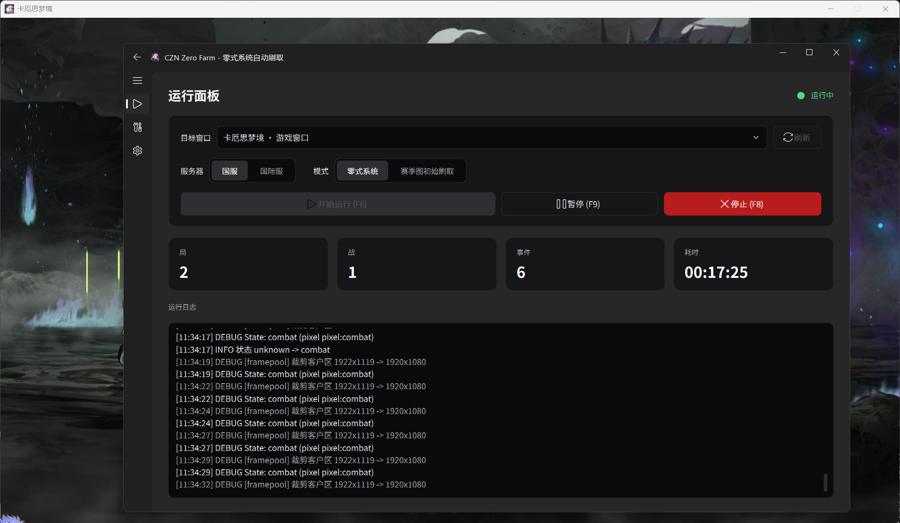

# CZN Zero Farm

> 《卡厄思梦境》（Chaos Zero Nightmare）PC 端零式系统自动刷取脚本

[](https://www.python.org/)
[](https://www.microsoft.com/windows)
[](https://github.com/zhiyiYo/PyQt-Fluent-Widgets)
[](LICENSE)

基于 **OpenCV 模板匹配 + 状态机** 的纯视觉自动化脚本，无需 AI 模型、无需 GPU。
通过截图识别游戏画面状态，按配置坐标自动点击，实现零式系统全流程无人值守刷取。支持 **国服 / 国际服** 双版本。



## 核心特性

| 能力 | 说明 |
|---|---|
| 全流程自动刷层 | 主菜单 → 零式入口 → 选/合成法典 → 配队 → 选 Buff → 选房间 → 战斗 → 结算，自动循环 |
| 状态机识别 | 49 个游戏状态，有序模板匹配 + 像素点校验双重判定 |
| 自动战斗 | 检测自动战斗开关并一键开启；按手牌轮廓自动出牌 |
| 三种输入后端 | PostMessage（后台不碰鼠标，推荐）/ SendMessage（后台）/ SendInput（前台） |
| 三种截图后端 | FramePool（后台/遮挡可截，默认）/ PrintWindow（后台可截）/ DXGI（前台最快） |
| 双版本模板 | 国服 / 国际服模板一键切换 |
| 全局热键 | F6 开始 / F8 停止 / F9 暂停（需管理员权限） |
| 现代化 GUI | PySide6 + Fluent 暗色界面，内置调试工具 |
| 防锁屏 | 运行期间可阻止系统休眠 / 锁屏 |

## 工作原理

截屏 → 识别当前画面状态 → 按 `config.json` 配置坐标点击，循环执行。

## 系统要求

| 项目 | 要求 |
|---|---|
| 操作系统 | Windows 10 / 11 |
| Python | 3.11+（仅源码运行需要） |
| 游戏 | 卡厄思梦境 — 国服 / 国际服 |
| 分辨率 | 推荐 1920×1080 |
| 权限 | 管理员权限（全局热键需要） |

## 快速开始

### 打包版（推荐）

1. 前往 [Releases](../../releases) 下载 `CZN_Zero_Farm.zip`。
2. 解压后 **右键以管理员身份** 运行 `CZN_Zero_Farm.exe`。

### 源码运行

```bash
git clone https://github.com/<your-name>/czn_auto.git
cd czn_auto
pip install -r requirements.txt
python -m core.gui
```

> 未以管理员身份运行时，F6/F8/F9 可能失效，界面按钮仍可用。

## 使用指南

1. 启动游戏并进入主菜单。
2. 在 **「设置」** 中调整服务器版本、输入模式、截图方式等参数。
3. 点击 **「开始」** 或按 **F6**；**F8** 停止，**F9** 暂停/继续。

| 热键 | 功能 |
|---|---|
| F6 | 开始 |
| F8 | 停止 |
| F9 | 暂停 / 继续 |

## 项目结构

```
czn_auto/
├─ core/
│  ├─ gui/             # PySide6 + Fluent GUI
│  ├─ screencap/       # 屏幕捕获后端
│  ├─ input/           # 输入后端
│  ├─ matcher/         # 模板匹配 + 状态检测
│  ├─ ocr/             # OCR 后端
│  ├─ combat.py        # 战斗自动出牌
│  └─ keepawake.py     # 防锁屏
├─ templates/          # 模板图 + 像素规则
├─ config.json         # 运行配置
└─ packaging/          # 打包脚本
```

## 免责声明

本项目仅供学习与个人研究使用。使用自动化脚本可能违反游戏的用户协议，由此带来的封号等一切风险由使用者自行承担。
